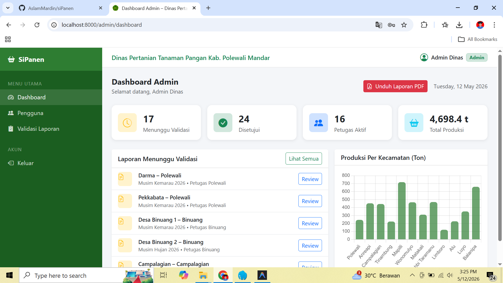
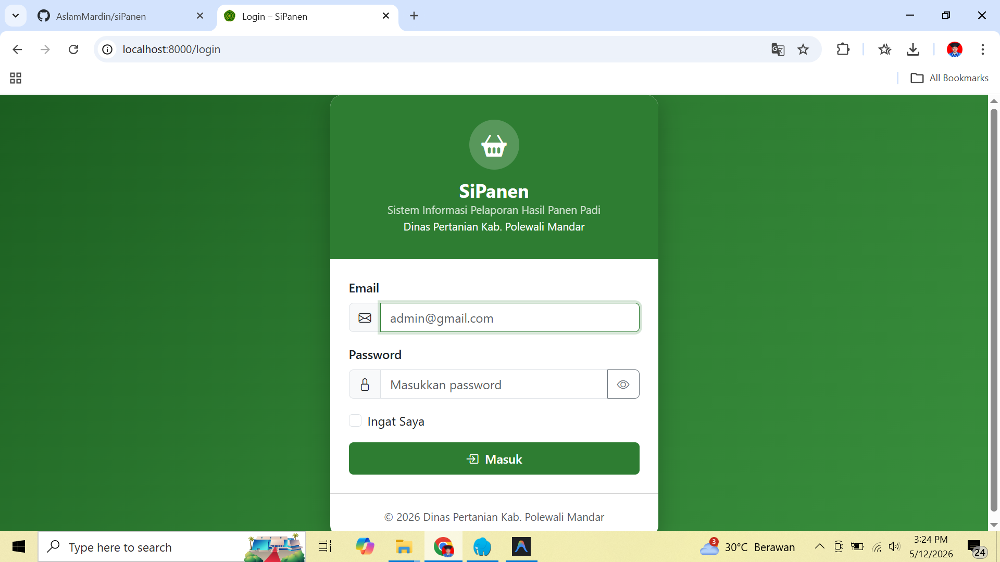
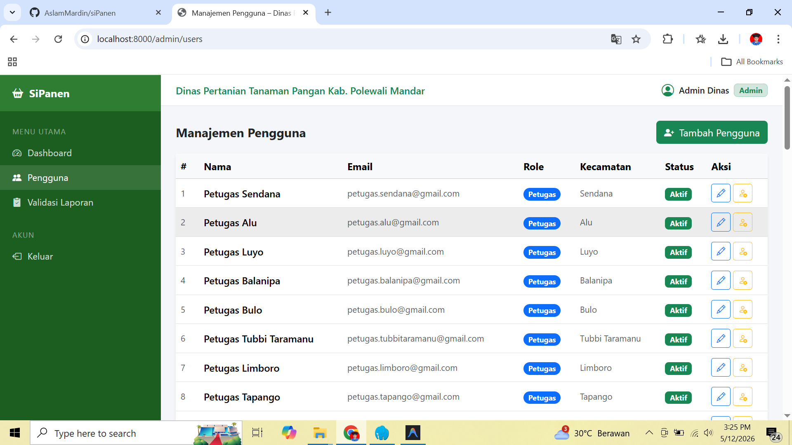

# siPanen (Sistem Informasi Pencatatan Panen)

siPanen adalah aplikasi berbasis web yang dikembangkan menggunakan framework Laravel untuk mendigitalisasi proses pencatatan, pelaporan, dan validasi hasil panen pertanian (khususnya komoditas padi) dari tingkat desa, kecamatan, hingga ke tingkat dinas terkait.

## 👥 Role Pengguna (Hak Akses)

Aplikasi ini memiliki 3 tingkatan pengguna dengan peran yang berbeda-beda:

1. **Petugas (Penyuluh / Petugas Lapangan)**
   - Bertugas memasukkan data hasil panen dari desa-desa yang berada di bawah wilayah kecamatannya.
   - Dapat menyimpan laporan sebagai "Draft" (sementara) sebelum dikirim.
   - Mengirim laporan untuk divalidasi oleh Admin.
   - Memperbaiki laporan jika ditolak (dikembalikan) oleh Admin dengan melihat catatan penolakan.

2. **Admin (Dinas / Verifikator)**
   - Menerima dan memeriksa laporan yang dikirim oleh Petugas (berstatus *Menunggu Validasi*).
   - Memiliki wewenang untuk **Menyetujui (Approve)** atau **Menolak (Reject)** laporan.
   - Jika menolak, Admin wajib memberikan *Catatan Penolakan* agar Petugas mengetahui bagian mana yang harus diperbaiki.
   - Mengelola master data sistem (seperti daftar Kecamatan, Desa, dan akun Pengguna).

3. **Pimpinan (Kepala Dinas / Eksekutif)**
   - Memiliki akses pemantauan (*view-only*) terhadap laporan yang sudah berstatus valid/disetujui.
   - Melihat ringkasan data, grafik produktivitas, dan mencetak laporan akhir (Dashboard Eksekutif).

---

## 🔄 Alur Aplikasi (Workflow)

1. **Input Data (Oleh Petugas):** Petugas lapangan *login* dan masuk ke menu **Tambah Laporan**. Mereka mengisi formulir hasil panen berdasarkan keadaan riil di lapangan.
2. **Status Pengiriman:** 
   - Jika data dirasa belum final, Petugas memilih **"Simpan Draft"** (Status: `draft`). Laporan belum masuk ke Admin dan masih bisa bebas diedit kapan saja.
   - Jika data sudah valid, Petugas memilih **"Kirim untuk Validasi"** (Status: `menunggu_validasi`). Laporan terkunci, Petugas tidak bisa lagi mengeditnya, dan laporan masuk ke antrean Admin.
3. **Proses Validasi (Oleh Admin):** Admin mengecek daftar laporan yang masuk.
   - Jika valid, Admin mengklik **Setujui** (Status: `disetujui`). Laporan menjadi data resmi.
   - Jika terdeteksi anomali atau kesalahan (contoh: angka produksi tidak masuk akal dibandingkan luas panen), Admin mengklik **Tolak** dan mengisi catatan (Status: `ditolak`).
4. **Revisi (Jika Ditolak):** Laporan yang ditolak akan kembali terbuka untuk diedit oleh Petugas disertai *Catatan Penolakan* dari Admin. Petugas merevisi datanya lalu mengirimkannya kembali.
5. **Monitoring (Oleh Pimpinan):** Pimpinan dapat melihat akumulasi total luas lahan, total produksi, dan produktivitas per wilayah secara *real-time*.

---

## 📊 Fitur Analisis Dashboard Admin

Dashboard Admin dirancang dengan konsep **"Dari Ringkasan ke Rincian"**, menceritakan kondisi pertanian dari berbagai sudut pandang waktu, wilayah, dan musim. Berikut komponen utama analisis yang ada di dalamnya:

1. **Kartu Pertumbuhan (YoY Growth):** Menampilkan perbandingan performa total panen tahun berjalan dengan tahun sebelumnya dalam bentuk persentase. Panah hijau ke atas menandakan kenaikan produksi, sedangkan panah merah ke bawah menandakan penurunan.
2. **Kartu Kontribusi Musim Terakhir:** Membantu admin melihat hasil panen musim tanam yang baru saja/sedang berjalan, lengkap dengan persentase seberapa besar musim tersebut menyumbang bagi total target produksi di tahun ini.
3. **Total Hasil Panen Pertahun (Bar Chart):** Grafik khusus (*dedicated*) untuk melihat tren total produksi per tahun secara historis dari tahun ke tahun.
4. **Perbandingan Musim per Tahun (Combo Chart):** Grafik yang memperlihatkan dan membedakan produksi Musim Hujan dan Musim Kemarau di setiap tahunnya secara berdampingan, memudahkan analisa musim apa yang mendominasi.
5. **Proporsi Musim Tahun Ini (Doughnut Chart):** Khusus menyorot persentase porsi (share) masing-masing musim khusus di tahun berjalan saja.
6. **Tabel Ringkasan (Year-To-Date):** Tabel data numerik riil untuk dilaporkan/dikutip ke dalam press release atau dokumen formal pemerintah.
7. **Produksi Per Kecamatan:** Memetakan produktivitas masing-masing wilayah untuk distribusi bantuan sumber daya secara tepat sasaran.

---

## 📝 Contoh Pengisian Formulir Laporan Panen (Bagi Petugas)

Berikut adalah simulasi jika Anda adalah seorang Petugas yang sedang mengisi laporan melalui halaman `laporan/create`:

- **Desa / Kelurahan:** `Desa Suka Maju` *(Dropdown ini otomatis hanya menampilkan desa di wilayah penugasan kecamatan Anda)*
- **Musim Tanam:** `Musim Kemarau` *(Pilih Musim Hujan atau Kemarau)*
- **Tahun:** `2024`
- **Luas Tanam (ha):** `15.5` *(Gunakan titik untuk mewakili desimal, berarti 15,5 Hektare)*
- **Luas Panen (ha):** `15.0` *(Diisi lebih kecil dari Luas Tanam jika ada sebagian lahan yang gagal panen/puso)*
- **Produksi (ton):** `90` *(Total hasil panen riil dalam satuan ton)*
- **Produktivitas (ton/ha):** *(Kolom ini *readonly* / tidak perlu diisi manual. Sistem akan menghitung otomatis: 90 ÷ 15.0 = `6.0000 ton/ha`)*
- **Varietas Padi:** `Inpari 32` *(Bisa dipilih dari daftar yang muncul atau diketik manual, misal: Ciherang, IR64, dll)*
- **Keterangan:** `Panen berjalan lancar, 0,5 Ha lahan mengalami gagal panen akibat kekeringan.` *(Opsional)*

Setelah form di atas lengkap, Petugas tinggal menekan tombol **"Kirim untuk Validasi"** agar data segera dicek oleh Admin.

## 📸 Screenshots

- **Dashboard Admin**: 
- **Formulir Panen**: 
- **Laporan Panen**: 
- **Halaman Login**: 
- **Manajemen Pengguna**: 
